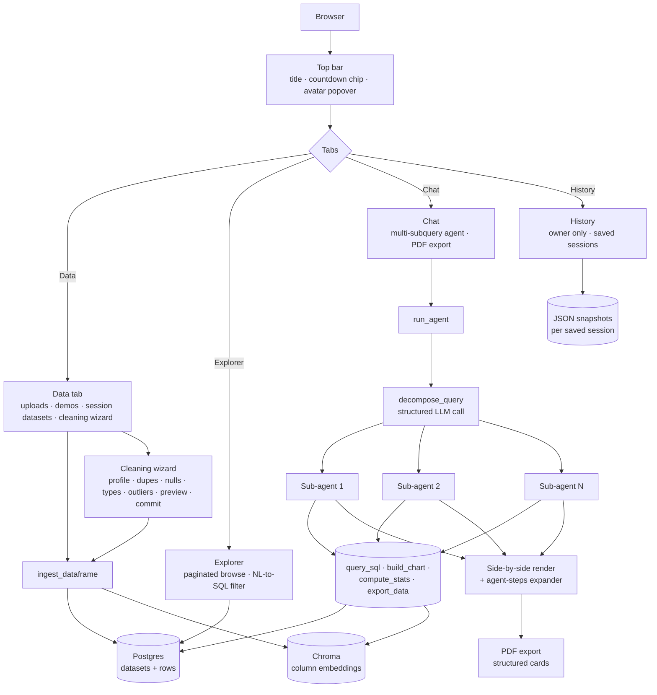

# Data Analysis Agent

**Live demo:** (https://ai-data-analysis-visualization-agent.streamlit.app/)

A natural-language data analyst in your browser. Drop a CSV, ask a question in plain English, get back SQL, charts, and a clean answer. Full session history, structured PDF reports, and a multi-step cleaning wizard that handles the gross parts of real-world data for you.

I built this end to end as a portfolio project. Streamlit on the front, LangChain + GPT-4o doing the agent work, Postgres + Chroma underneath. Proper guest-vs-owner separation, rate limiting, and a guided cleaning flow that I haven't really seen baked into other open analytics tools.

## What it does

You upload a dataset (or pick a demo). Go to the Chat tab, type something like *"top 10 emitters in 2020 and how their CO2 per capita changed since 1990"*, and the agent does roughly this:

- Breaks the question into independent sub-questions using a structured-output LLM call. No flaky regex, no JSON parsing that occasionally craters.
- Spawns a separate agent per sub-question so they don't bleed context, chart preferences, or dataset choices into each other. This was the single biggest reliability win in the rewrite.
- Each sub-agent picks the right table, writes the SQL, runs it, picks a chart type if one actually fits, and answers in prose.
- Renders side by side, with SQL exposed in an expander so you can verify the facts.
- Export the whole session as a PDF report with one structured card per sub-result.

If you're the owner (password-gated), you also get a guided cleaning wizard before ingestion, persistent saved sessions, and history. Guests get the same analytical experience, rate-limited, with the cleaning and history features visibly locked so they know what's behind the curtain.

## Architecture at a glance



### Stack

Streamlit for the UI, with a custom dark theme. No sidebar — I replaced it with a top bar that holds the avatar popover for auth and a live countdown chip for the guest quota.

The agent layer is LangChain AgentExecutor with tool calls. GPT-4o-mini handles routing and decomposition (cheap and fast), GPT-4o handles the heavier analysis. Decomposition and follow-up detection both use Pydantic structured output so there's no JSON parsing fragility — when the LLM says "split into 3 questions," I get a typed Python object back, not a string I have to parse.

SQL goes through SQLAlchemy against Postgres. There's a regex blocklist on the read path that rejects anything that isn't a single SELECT — more on that in the security section.

Chroma stores per-column embeddings so the agent can find the right table by intent. If you ask about "carbon dioxide per person," it can find the `co2_per_capita` column without you having to say the exact name.

Cleaning is plain pandas underneath a wizard state machine. fpdf2 generates PDFs, plotly + kaleido renders charts as PNGs for the report, openpyxl handles Excel exports.

## The two personas

| | Guest | Owner |
|---|---|---|
| Chat queries | 10 per UTC day | unlimited |
| Concurrent uploaded files | 5 (10 MB each) | unlimited |
| Demo datasets | full read access | full read access |
| Upload | one-click upload | upload OR guided clean-and-upload |
| Cleaning wizard | locked teaser button | full multi-step wizard |
| Delete own datasets | yes (own session only) | yes |
| See other users' uploads | no | no, owner sees only owner uploads + demos |
| History tab | colored locked banner | full saved-session browser |
| Save / load sessions | no | yes, with optional labels |
| Dataset retention | 24h rolling, auto-cleaned at first interaction past the boundary | persistent |

Guests are identified by a browser fingerprint, which is just a hash of IP + User-Agent + Accept-Language. So if a friend opens a shared URL, they get their own fresh workspace instead of inheriting yours. Rate limiting keys on the IP hash only, separately from the fingerprint.

## The cleaning wizard (owner only)

This is the part I'm probably most proud of. Most "upload your data" tools just dump whatever you give them straight into a table. Real data is rarely that polite — dates as strings, sentinel values for nulls, duplicate rows from bad joins upstream, outliers from sensor noise. So when the owner hits **Clean & Upload** instead of the plain Upload button, the wizard takes over the Data tab.

Seven steps, each with Back / Cancel / Continue:

**Profile.** Row count, column dtypes, null counts and percentages, unique counts, sample values, duplicate count. Just so you can see what you're working with.

**Duplicates.** Keep first, keep last, drop all, or skip. Applied to the full row.

**Nulls.** Per-column dropdown for every column that has nulls. Options are drop-row, fill with mean / median / mode, fill with a constant (with a text input), or leave. Numeric columns default to fill-mean, non-numeric default to fill-mode, so you can blow through it fast if you don't care about the specifics.

**Types.** Detected dtype shown alongside a suggested target. The wizard looks at the column name and a sample of values — if it sees `date` or `time` and the samples parse as dates, it suggests datetime. Numeric strings get a numeric suggestion. Everything is overridable.

**Outliers.** Choose IQR (1.5x rule) or z-score with a tunable threshold. For each numeric column, choose clip, drop, or leave. The wizard shows the outlier count under the current method so you can decide before you commit.

**Preview.** Side-by-side metrics for row count and total nulls, with deltas vs the original. Sample of the cleaned dataframe and a JSON dump of the full plan, so you can see exactly what's about to happen.

**Commit.** Requires an explicit checkbox that says "yes I know this replaces the original table." On commit, the cleaned dataframe goes through the normal `ingest_dataframe` path. Postgres table swap is atomic. Chroma re-embeds the column metadata so the agent still finds the table by intent. Wizard state resets.

Cancel at any step throws away the in-progress plan.

## History tab

Owner only. Lists every session that was saved via the in-tab save button, which also auto-fires on a guest→owner switch so you don't lose accidental chat history when toggling modes. Each session is an expander with the full transcript, styled bubbles for user and agent turns, and inline previews of any data tables that came back. Download the raw JSON snapshot, or delete the session.

Guests see a single locked banner with a gradient and a one-line note about what they're missing. The tab is visible on purpose so the feature is discoverable — you just can't open it without auth.

## Security

A few things I took seriously, even though it's a personal project.

**Query path.** Every SQL string the agent generates goes through a regex blocklist that rejects INSERT / UPDATE / DELETE / DROP / CREATE / ALTER / TRUNCATE / GRANT / REVOKE / EXEC, and any statement that contains a semicolon (so no statement chaining). Only a single SELECT gets through. The explorer's plain-English filter goes through the same gate plus a separate LLM call that only returns a WHERE condition. The rest of the query is templated, so the LLM can't escape into a different table or a different statement.

**Owner auth.** Password lives in Streamlit's `st.secrets`, never in the repo. Wrong attempts get a single error message. Once authenticated, the owner flag sits in `st.session_state` for that browser session only.

**Guest isolation.** Each guest gets a browser fingerprint as their session ID. Every dataset query filters on `session_id = <my fingerprint> OR is_demo = TRUE`. Owner uploads have `owner_only = TRUE` and are excluded from the guest view. The owner query excludes any row with a `session_id` set, so an owner never sees a guest's dataset either. This is enforced at the SQL layer in `db.postgres.list_datasets_from_db`, not just in the UI.

**Upload validation.** Files get rejected if they're over 10 MB, if the extension isn't csv / xlsx / xls, or if more than 5 are already attached to the guest's session. Streamlit's file uploader enforces the type list at the browser layer too.

**Rate limiting.** Guest queries get counted in Postgres against the IP hash and today's UTC date. Same hash gets used for upload counters too, though those aren't capped (the concurrent file + per-file size cap is enough). A small dev script (`scripts/reset_guest_limit.py`) lets me wipe usage rows during testing.

**Data retention.** Guest datasets have a hard 24-hour TTL via `cleanup_old_guest_datasets`. The cleanup runs once per UTC day at the first user interaction past midnight. When you delete a dataset, the dataset row, the underlying Postgres table, and all related Chroma embeddings get purged together. No orphan path that I'm aware of.

**No secrets in the repo.** API keys go in `.env` (gitignored), the owner password goes in `.streamlit/secrets.toml` (also gitignored). The repo ships an `.env.example` so you know what's needed.

What I haven't done: row-level encryption, formal audit logs, pen-test. This is a portfolio project, not a production analytics platform. If I were deploying it for real users I'd add structured logging, an audit trail per session, and probably move guest sessions onto a separate schema with row-level security.

## Setup

```bash
git clone <this-repo>
cd "data analysis agent"
python -m venv .venv && source .venv/bin/activate
pip install -r requirements.txt
cp .env.example .env   # then fill in OPENAI_API_KEY and DATABASE_URL
python setup_db.py     # creates tables, loads demo datasets
streamlit run app.py
```

For owner access, add `owner_password = "yourpassword"` to `.streamlit/secrets.toml`.

## Tests

```bash
pytest
```

47 unit tests cover SQL safety, rate limiting, dataset profiling, cleaning ops (dedupe / nulls / types / outliers), PDF generation, and agent schema parsing. CI isn't wired up yet, that's on the list.

## Repo layout

```
app.py                          Streamlit entry, global CSS, tab orchestration
agent/
  agent.py                      run_agent, decompose_query, detect_followup, run_sub_agent
  prompts.py                    System and structured-output prompts
  schema.py                     Pydantic models (AnalysisOutput, SubQueryResult, etc.)
  tools.py                      Tools the agent can call
core/
  cleaning_wizard.py            Pure pandas cleaning ops
  dataset_profiler.py           Profile, ingest, re-embed
  pdf_export.py                 Structured-card PDF generation
  rate_limiter.py               IP-hash quotas, browser fingerprinting
  session_manager.py            Save, load, list session snapshots
db/
  postgres.py                   Read-only SQL exec, dataset registry, guest usage
  vector_store.py               Chroma index for column embeddings
ui/
  auth.py                       Single import surface for is_owner / can_query / switch_*
  topbar.py                     Title, countdown chip, avatar popover
  data_tab.py                   Uploads, demos, session datasets
  cleaning_wizard_ui.py         Multi-step wizard UI
  chat.py                       Chat tab, PDF export, agent integration
  explorer.py                   Paginated browse with NL-to-SQL filter
  history.py                    Owner saved-session browser
scripts/
  reset_guest_limit.py          Dev utility for wiping rate-limit rows
  gen_demo_data.py              Regenerates the demo CSVs
tests/                          pytest suite
data/demo/                      sp500_financials, titanic, world_co2_emissions
```


